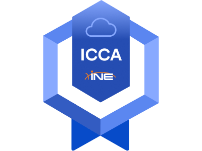

# f4dee

🔐 Estudiante de ciberseguridad, en constante aprendizaje enfocado al Pentesting.
📝 Publico writeups, notas y otros recursos en mi blog personal: [f4dee-backup.github.io](https://f4dee-backup.github.io)
🛠️ Aquí encontrarás PoCs y herramientas. [GitHub](https://github.com/f4dee-backup)

---

## Certifications

  
  
  
  

---

## Language

  
  
  

